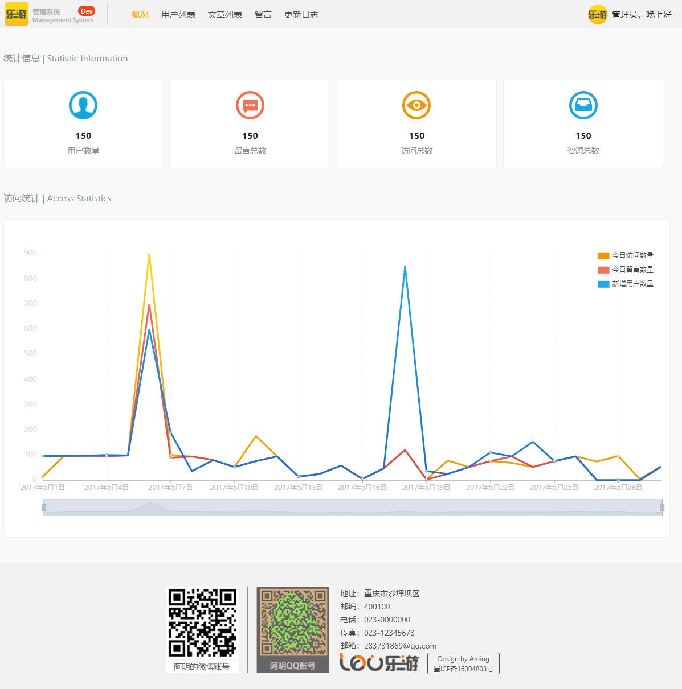
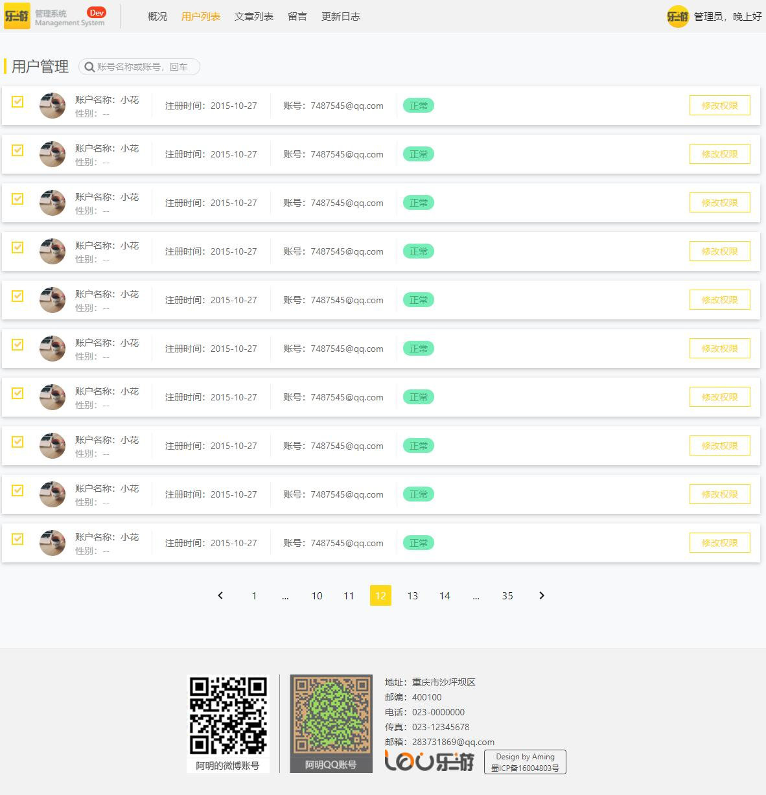
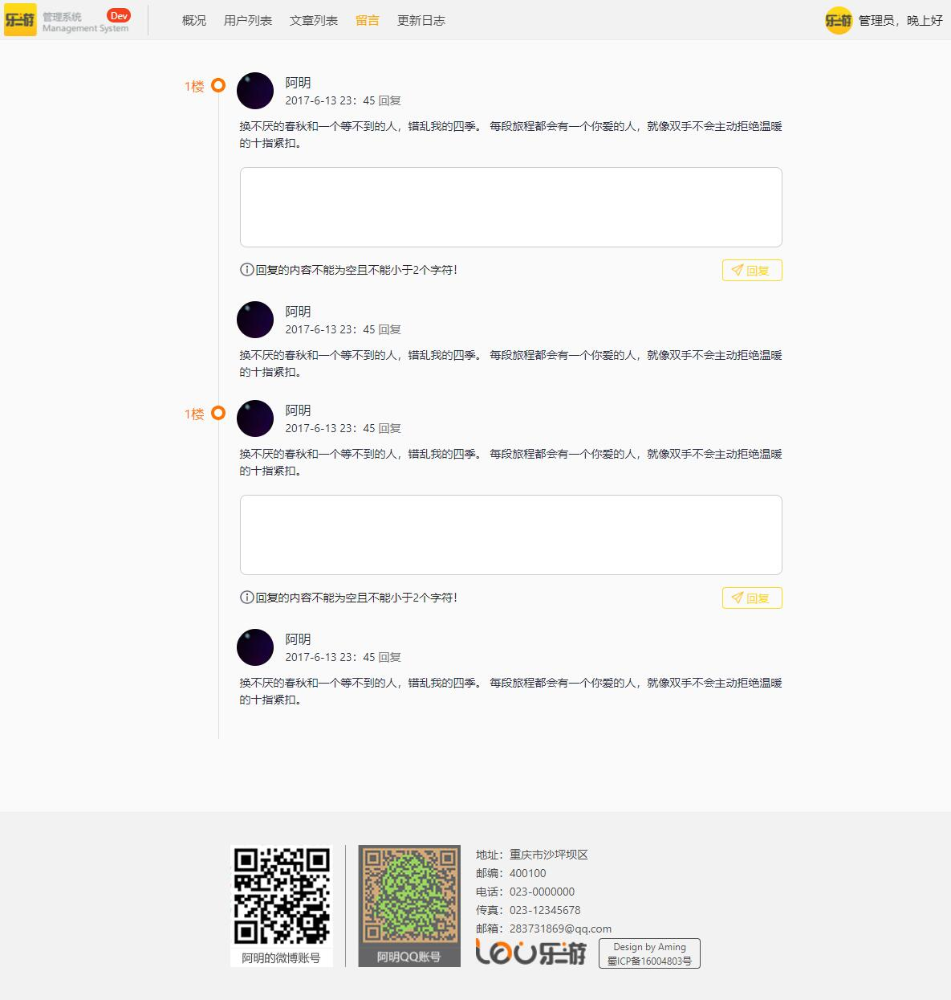
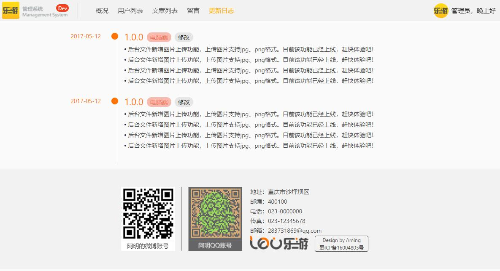

## Vue+Vue-router+Vuex后台管理系统
- Github项目地址:[https://github.com/Tecode/vue-admin](https://github.com/Tecode/vue-admin)
- 网站地址: [http://vue.soscoon.com/home](http://vue.soscoon.com/home)
- 欢迎star

## 安装

``` bash
# 克隆项目

git clone https://github.com/Tecode/vue-admin.git

# install dependencies
npm install # or yarn

# serve in dev mode, with hot reload at localhost:8080
npm run dev

# build for production
npm run build

# serve in production mode
npm start
```

## 说明

- 启动项目以后直接进入页面不需要登录,由于没有api无法登录
- 直接输入[http://localhost:8088/](http://localhost:8088/)访问首页

```bash
# 路由列表
      { path: '/home', component: Home },
      { path: '/user_list/:page(\\d+)?', component: UserList },
      { path: '/article_list/:page(\\d+)?', component: ArticleList },
      { path: '/message/:page(\\d+)?', component: Message },
      { path: '/update_log/:page(\\d+)?', component: UpdateLog },
      { path: '/update_log_edit/:page(\\d+)?', component: UpdateLogEdited },
      { path: '/article_edit/:id?', component: ArticleEdit },
      // { path: '/user/:id', component: UserView },
      { path: '/', redirect: '/home' }

```

## 预览图

### 首頁

<div align="center">

</div>

### 用戶列表

<div align="center">

</div>

### 留言

<div align="center">

</div>

### 更新日志

<div align="center">

</div>
